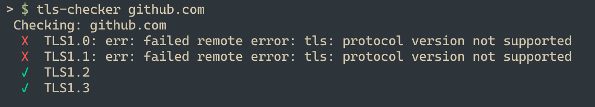

# tls-checker
Simple TLS checker.

You can either pass in the hostname as an argument to the program or you can interactively input it at runtime.

##  
```bash
go install github.com/lukasmwerner/tls-checker@latest
```

### Sample Execution


